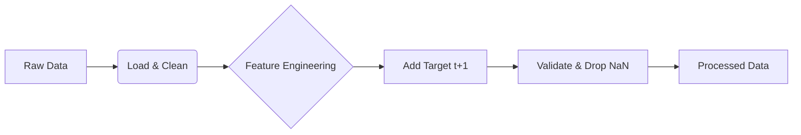

# Build Features Module Documentation

**File**: `stock_ai/features/build_features.py`  
**Purpose**: Feature Engineering for Stock AI Forecasting System

This module is the core "Feature Engineering" step of the pipeline. It transforms raw OHLCV (Open, High, Low, Close, Volume) data into a structured dataset of **16 technical features** suitable for training machine learning models.

---

## 1. High-Level Data Flow

The script operates as a pipeline:

1.  **Input**: Reads raw stock data (CSV/Parquet) from `data/raw`.
2.  **Transformation**: `FeatureBuilder` class calculates features in a specific order.
3.  **Target Generation**: Adds a "Target" column (Next Day's Return) for supervised learning.
4.  **Validation**: Checks for mathematical errors (Infinity, NaN) and sufficient data length.
5.  **Output**: Saves the clean, processed data to `data/processed` as Parquet (default) or CSV.



---

## 2. Financial Logic & Features (The "Why")

We calculate 16 standardized features divided into 5 financial categories. All features are **Look-Ahead Safe** (calculate at time `t` using only history).

### A. Price Dynamics (Momentum & Volatility)
*Captures the "speed" and "risk" of price movement.*

| Feature | Financial Concept | Why it matters? |
|:---|:---|:---|
| **`log_return_t`** | **Logarithmic Returns** | Unlike simple % change, log returns are additive over time and statistically better behaved (closer to normal distribution). |
| **`mean_return_5`** | **Weekly Momentum** | Trends over the last week (5 trading days). Positive = Short-term Uptrend. |
| **`mean_return_20`** | **Monthly Momentum** | Trends over the last month (~20 trading days). |
| **`std_return_5`** | **Weekly Volatility** | Short-term risk. High values = Price is jumping around wildly this week. |
| **`std_return_20`** | **Monthly Volatility** | Baseline risk. Used to compare against the short-term volatility. |

### B. Volatility Regime (Market Mood)
*Is the market calm or panicked?*

| Feature | Financial Concept | Why it matters? |
|:---|:---|:---|
| **`ATR_14_norm`** | **Normalized ATR** | Average True Range scaled by price. Tells us the average daily move as a %. (e.g., "This stock typically moves 2% a day"). |
| **`vol_ratio`** | **Volatility Compression/Expansion** | Ratio of `std_5 / std_20`. >1 means volatility is expanding (breakout soon?); <1 means consolidating. |
| **`vol_percentile_252`** | **Historical Risk Rank** | How risky is today compared to the last year (252 days)? 1.0 = Riskiest day of the year. 0.0 = Calmest. |

### C. Volume Regime (Liquidity & Conviction)
*Volume confirms price. Price moving up on low volume is weak; on high volume is strong.*

| Feature | Financial Concept | Why it matters? |
|:---|:---|:---|
| **`volume_z`** | **Abnormal Volume** | Z-Score (Standard deviation from mean). +3 means "3 sigma event" - extremely unusual buying/selling pressure. |
| **`relative_volume`** | **Volume Trend** | Today's volume vs 50-day average. > 1.5 implies 50% more activity than usual. |
| **`volume_volatility`** | **Volume Consistency** | Is volume steady (institutions accumulating) or erratic (news driven)? |

### D. Trend Context (Relative Position)
*Where is the price relative to its average?*

| Feature | Financial Concept | Why it matters? |
|:---|:---|:---|
| **`dist_MA20`** | **Short-term Mean Reversion** | Distance from 20-day Moving Average. If too high, it might revert down (overbought). |
| **`dist_MA50`** | **Medium-term Trend** | Distance from 50-day Moving Average. Often acts as support/resistance. |
| **`trend_strength`** | **Sharpe-like Ratio** | `Return / Risk` over 20 days. High value = Clean, smooth trend. Low value = Choppy, noisy trend. |

### E. Market Relative (Alpha & Beta)
*How does this stock move compared to the Index (Nifty 50)?*

| Feature | Financial Concept | Why it matters? |
|:---|:---|:---|
| **`rel_return`** | **Alpha (Excess Return)** | Stock Return minus Market Return. Did we beat the market today? |
| **`beta_approx_20`** | **Rolling Beta** | Sensitivity to market. Beta=1.5 means if Nifty goes up 1%, this stock likely goes up 1.5%. High beta = aggressive. |

---

## 3. Code Analysis (Line-by-Line Logic)

Here is a breakdown of the key logic blocks in `stock_ai/features/build_features.py`:

### The `FeatureBuilder` Class

**Initialization (`__init__`)**
- Accepts `market_index_data` (Nifty 50 DataFrame). This is optional; if missing, market-relative features are skipped/defaulted.

**Data Loading (`load_stock_data`)**
- Reads CSV/Parquet.
- **Critical**: Converts `date` column to datetime objects and **sorts by date**. Time-series data MUST be sorted chronologically for rolling windows to work.

**Log Returns (`calculate_log_returns`)**
```python
df['log_return_t'] = np.log(df['close'] / df['close'].shift(1))
```
- Uses `shift(1)` to get yesterday's close.
- $\ln(Close_t) - \ln(Close_{t-1})$.

**Price Dynamics (`calculate_price_dynamics`)**
- Uses `.rolling(window=X)`.
- `min_periods=X`: Ensures we don't calculate an average if we have missing data (e.g., at the very start of the history).

**ATR Calculation (`calculate_atr`)**
- Calculates "True Range" (TR), which is the greatest of:
    1. Today's High - Low
    2. |Today's High - Yesterday's Close| (Gap Up)
    3. |Today's Low - Yesterday's Close| (Gap Down)
- ATR is the 14-day average of TR.

**Market Relative Logic (`calculate_market_relative`)**
- **Merges** the stock data with market data on `date`.
- Calculates **Covariance** (how they move together) and **Variance** (market volatility) over 20 days.
- $\beta = \frac{Cov(r_{stock}, r_{market})}{Var(r_{market})}$
- If market data is missing for a specific date, it fills Beta with 1.0 (assumption: stock moves with market).

**Validation (`validate_features`)**
- Checks for **Data Leakage**: Features at row `t` should not be NaN *after* the warmup period.
- Checks for **Infinity**: Division by zero (e.g., zero volume) is handled by adding `+ 1e-8` (epsilon) in denominators throughout the code.

### The `process_ticker` Function (The Driver)

1.  **Input Checks**: Skips stocks with < 300 rows (too short for statistical significance).
2.  **Build**: Calls `build_all_features`.
3.  **Target**: Creates `target = shift(-1)` (Tomorrow's return).
4.  **Drop NaNs**: The first 252 rows will have NaNs (due to `vol_percentile_252` needing a year of data). These are dropped.
    - *Note*: This means we lose the first year of data for every stock! This is the cost of using long-term features.
5.  **Save**: Writes to disk.

### The `main` Function

- Uses `argparse` to handle command line arguments.
- Supports processing:
    - A single ticker (`--ticker`)
    - All files in a directory (`--input`)
- Loads the Market Index *once* at the start to avoid reloading it for every stock.

---

## 4. Usage Guide

### Prerequisites
Ensure you have raw data in `data/raw`. This usually comes from `scripts/data/download_data.py`.

### Running the Script

**1. Basic Run (Process all stocks)**
```bash
python build_features.py --input ../data/raw --output ../data/processed
```

**2. With Market Context (Nifty 50)**
Ideally, download Nifty 50 first:
```bash
# In stock_ai/scripts/data/
python download_data.py --tickers ^NSEI --start 2010-01-01
```
Then run feature building:
```bash
# In stock_ai/features/
python build_features.py --input ../data/raw --output ../data/processed --market-index ^NSEI
```

**3. Debugging a Single Stock**
If a specific stock is failing or you want to check its output:
```bash
python build_features.py --input ../data/raw --output ../data/processed --ticker RELIANCE.NS
```

---

## 5. Directory Structure Implication

After running this usage:
- **`data/raw/`**: Contains original OHLCV (e.g., `RELIANCE.NS.csv`).
- **`data/processed/`**: Will contain feature-rich files (e.g., `RELIANCE.NS.parquet`).
    - Rows: ~250 fewer than raw (due to warmup).
    - Columns: ~23 columns (Raw 5 + Features 16 + Target 1 + Date).

## 6. Common Issues & Fixes

1.  **"Market index file not found"**:
    - The script looks for `^NSEI.csv` or `NSEI.csv` in `data/raw`. Ensure you downloaded it.
    - If missing, `rel_return` becomes 0 and `beta` becomes 1. This is safe but less accurate.

2.  **"Insufficient valid rows"**:
    - If a stock is too new (e.g., IPO last month), it won't have 252 days of history for the volatility percentile. It will be skipped.

3.  **"Infinite values"**:
    - Usually caused by `volume=0` or `price=0` (data errors). The script attempts to handle this with epsilon (`1e-8`), but bad data should ideally be cleaned before this step.
